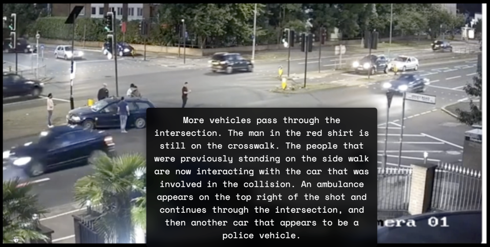

# Story-Line Based Video Understanding Framework

## Overview
This project presents an innovative approach to video understanding through story-line extraction and analysis. Unlike traditional frame-by-frame analysis systems, our framework constructs continuous narratives (story-lines) from video content, enabling deeper contextual understanding and temporal reasoning.

## Key Features
- **Story-Line Construction**: Automatically identifies and connects related events across video segments to form coherent narratives
- **Event Causality Analysis**: Tracks cause-and-effect relationships between events to build meaningful story branches
- **Temporal Reasoning**: Maintains chronological context across video segments with overlapping analysis
- **Multi-Modal RAG System**: Combines visual analysis with text-based retrieval for comprehensive understanding
- **Hierarchical Story Structure**: Organizes events into main storylines with branching side-stories based on relevance and importance

## Architecture
The framework consists of several integrated components:
- **Segment Analysis**: Processes video segments to identify entities and events
- **Story Tree Construction**: Builds hierarchical story structures from detected events
- **Vector Store**: Enables semantic search across story-lines, events, and entities
- **RAG Agent**: Provides natural language interface for querying video content through story-lines

## Use Cases
- Surveillance video analysis
- Media content summarization
- Event detection and tracking
- Video search and retrieval by narrative content

## Examples
See demo notebooks:
- [Demo Search](demo_search.ipynb): Demonstrates story-line based retrieval
- [Demo Analyze](demo_analyze.ipynb): Shows the story-line extraction process
- [Main Experiment](main_experiment.ipynb): Complete end-to-end example

## Technical Details
The system uses GPT-4o for vision analysis and narrative construction, with a custom-built story tree structure that maintains relationships between events across video segments. Each story node contains information about event particularity, causality, and temporal context.

## Example

**[00:00.00]** The video begins showing a four-way intersection at night. There are several cars at the intersection with a clear view of the crosswalks, street lights, and surrounding buildings and trees.

**[00:03.07]** A black car enters the intersection going straight and a white SUV also enters the intersection and gets into a collision with a dark blue station wagon turning left. The station wagon sparks on the front left bumper area.

**[00:05.48]** A white van turns right on the intersection. A person in dark clothes can be seen walking on the sidewalk at the top of the shot, and a person in white clothes can be seen walking on the sidewalk to the bottom left of the shot. More cars enter the intersection.

**[00:17.01]** A red car makes a right turn, and then a silver car makes a left turn on the intersection. A few people can be seen standing on the sidewalk near where the collision occurred.

**[00:32.58]** A white truck enters the frame going straight through the intersection. A few more cars enter the intersection and a motorbike can be seen crossing the intersection from right to left on the top right of the shot. There are several people standing on the side walk near where the collision occurred and they appear to be talking to one another.

**[01:04.14]** A few more cars pass through the intersection in various directions, and a red double decker bus enters from the top right of the shot and makes a right turn. The people that were standing by the side walk start to walk out onto the cross walk.

**[01:40.68]** The people that were standing on the side walk begin to cross the road in different directions. A few more vehicles pass through the intersection in different directions, and a man in a red shirt crosses the cross walk.

**[02:01.12]** More vehicles pass through the intersection. The man in the red shirt is still on the crosswalk. The people that were previously standing on the side walk are now interacting with the car that was involved in the collision. An ambulance appears on the top right of the shot and continues through the intersection, and then another car that appears to be a police vehicle.

**[03:22.87]** The ambulance and police vehicles make their way across the intersection. More vehicles travel through the intersection. A few of the people that were on the sidewalk enter the road to look at the car more closely. A man walks on the crosswalk and stops briefly in front of the car and waves his hands in the air.

**[04:37.88]** The video ends with the cars still driving through the intersection and the people that were on the sidewalk are now out in the intersection looking at the car that was in the collision.

## Setup
- Python 3.10+ recommended.
- Install dependencies: `pip install -r requirements.txt`
- Set your OpenAI API key (required for summarization, embeddings, and agent):
  - macOS/Linux: `export OPENAI_API_KEY=sk-...`
  - Windows PowerShell: `$Env:OPENAI_API_KEY = "sk-..."`

All OpenAI clients and embeddings read from `OPENAI_API_KEY` and fail fast if it is missing.

## Quick Demo
An end-to-end minimal demo is provided to build the vector store and run a single agent query using the included `accident1` dataset.

1) Ensure the sample JSON analysis exists under `accident1/segment_analysis/segment_*.json` (already included).
2) Run: `python3 scripts/quick_demo.py`
3) The script will:
   - Build `Segment` objects from existing JSON files
   - Fill segments with targets/events via factories
   - Construct the `StoryPool`
   - Load LangChain documents and build a Chroma vector store
   - Initialize the ReAct agent and perform a storyline search query

Output includes the retrieved storyline summaries and full storyline details.

## Code Structure
- `classes/`
  - `Segment.py`: Basic segment container (images, targets, events, summary)
  - `TargetFactory.py`: Target entity model + factory (config-driven)
  - `EventFactory.py`: Event model + factory (config-driven)
  - `StoryTree.py`: Storyline construction, cumulative importance, and LLM summary
  - `VectorStore.py`: Chroma vector stores for storylines, events, targets, segments
  - `RAGAgent.py`: ReAct-based agent with tools for storyline/event/target/segment queries
- `modules/`
  - `ExtractFrames.py`: Video frame extraction
  - `SegmentGeneration.py` / `SegmentGenerationV2.py`: Build segments from frames (with/without overlap)
  - `SegmentAnalyze.py` / `SegmentAnalyzeV2.py`: LLM-based vision+text analysis for segments
  - `FillSegments.py`: Populate segments from precomputed JSON
  - `Load.py`: Convert segments/storylines/events/targets into LangChain documents
- `prompts/`: Prompts for analysis
- `accident1/`: Sample dataset + configs and segment analyses
- `scripts/quick_demo.py`: One-command demo to build vectors and query the agent